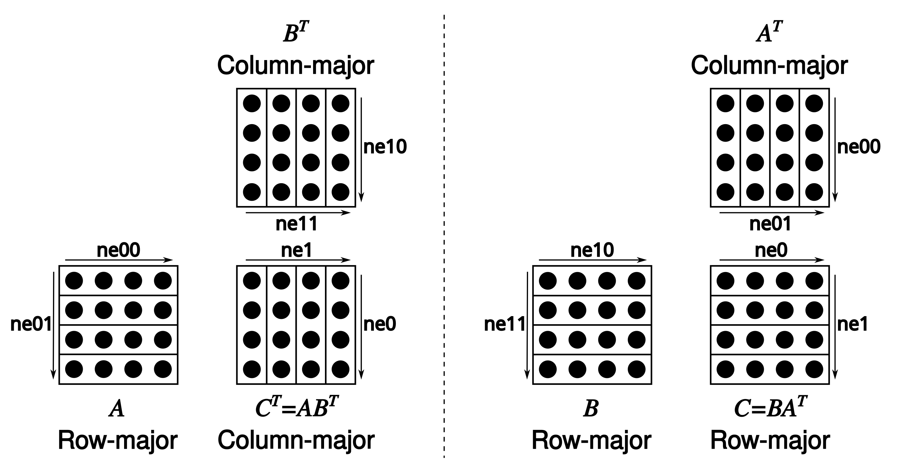

# Pull requests (for contributors)

- Test your changes:
    - Execute [the full CI locally on your machine](ci/README.md) before publishing
    - Verify that the perplexity and the performance are not affected negatively by your changes (use `llama-perplexity` and `llama-bench`)
    - If you modified the `ggml` source, run the `test-backend-ops` tool to check whether different backend implementations of the `ggml` operators produce consistent results (this requires access to at least two different `ggml` backends)
    - If you modified a `ggml` operator or added a new one, add the corresponding test cases to `test-backend-ops`
- Consider allowing write access to your branch for faster reviews, as reviewers can push commits directly
- If your PR becomes stale, don't hesitate to ping the maintainers in the comments

# Pull requests (for collaborators)

- Squash-merge PRs
- Use the following format for the squashed commit title: `<module> : <commit title> (#<issue_number>)`. For example: `utils : fix typo in utils.py (#1234)`
- Optionally pick a `<module>` from here: https://github.com/ggml-org/llama.cpp/wiki/Modules
- Consider adding yourself to [CODEOWNERS](CODEOWNERS)

# Coding guidelines

- Avoid adding third-party dependencies, extra files, extra headers, etc.
- Always consider cross-compatibility with other operating systems and architectures
- Avoid fancy-looking modern STL constructs, use basic `for` loops, avoid templates, keep it simple
- Vertical alignment makes things more readable and easier to batch edit
- Clean-up any trailing whitespaces, use 4 spaces for indentation, brackets on the same line, `void * ptr`, `int & a`
- Use sized integer types such as `int32_t` in the public API, e.g. `size_t` may also be appropriate for allocation sizes or byte offsets
- Declare structs with `struct foo {}` instead of `typedef struct foo {} foo`
    - In C++ code omit optional `struct` and `enum` keyword whenever they are not necessary
    ```cpp
    // OK
    llama_context * ctx;
    const llama_rope_type rope_type;

    // not OK
    struct llama_context * ctx;
    const enum llama_rope_type rope_type;
    ```

    _(NOTE: this guideline is yet to be applied to the `llama.cpp` codebase. New code should follow this guideline.)_

- Try to follow the existing patterns in the code (indentation, spaces, etc.). In case of doubt use `clang-format` to format the added code
- For anything not covered in the current guidelines, refer to the [C++ Core Guidelines](https://isocpp.github.io/CppCoreGuidelines/CppCoreGuidelines)
- Tensors store data in row-major order. We refer to dimension 0 as columns, 1 as rows, 2 as matrices
- Matrix multiplication is unconventional: [`C = ggml_mul_mat(ctx, A, B)`](https://github.com/ggml-org/llama.cpp/blob/880e352277fc017df4d5794f0c21c44e1eae2b84/ggml.h#L1058-L1064) means $C^T = A B^T \Leftrightarrow C = B A^T.$



# Naming guidelines

- Use `snake_case` for function, variable and type names
- Naming usually optimizes for longest common prefix (see https://github.com/ggml-org/ggml/pull/302#discussion_r1243240963)

    ```cpp
    // not OK
    int small_number;
    int big_number;

    // OK
    int number_small;
    int number_big;
    ```

- Enum values are always in upper case and prefixed with the enum name

    ```cpp
    enum llama_vocab_type {
        LLAMA_VOCAB_TYPE_NONE = 0,
        LLAMA_VOCAB_TYPE_SPM  = 1,
        LLAMA_VOCAB_TYPE_BPE  = 2,
        LLAMA_VOCAB_TYPE_WPM  = 3,
        LLAMA_VOCAB_TYPE_UGM  = 4,
        LLAMA_VOCAB_TYPE_RWKV = 5,
    };
    ```

- The general naming pattern is `<class>_<method>`, with `<method>` being `<action>_<noun>`

    ```cpp
    llama_model_init();           // class: "llama_model",         method: "init"
    llama_sampler_chain_remove(); // class: "llama_sampler_chain", method: "remove"
    llama_sampler_get_seed();     // class: "llama_sampler",       method: "get_seed"
    llama_set_embeddings();       // class: "llama_context",       method: "set_embeddings"
    llama_n_threads();            // class: "llama_context",       method: "n_threads"
    llama_adapter_lora_free();    // class: "llama_adapter_lora",  method: "free"
    ```

    - The `get` `<action>` can be omitted
    - The `<noun>` can be omitted if not necessary
    - The `_context` suffix of the `<class>` is optional. Use it to disambiguate symbols when needed
    - Use `init`/`free` for constructor/destructor `<action>`

- Use the `_t` suffix when a type is supposed to be opaque to the user - it's not relevant to them if it is a struct or anything else

    ```cpp
    typedef struct llama_context * llama_context_t;

    enum llama_pooling_type llama_pooling_type(const llama_context_t ctx);
    ```

    _(NOTE: this guideline is yet to be applied to the `llama.cpp` codebase. New code should follow this guideline)_

- C/C++ filenames are all lowercase with dashes. Headers use the `.h` extension. Source files use the `.c` or `.cpp` extension
- Python filenames are all lowercase with underscores

- _(TODO: abbreviations usage)_

# Preprocessor directives

- _(TODO: add guidelines with examples and apply them to the codebase)_

    ```cpp
    #ifdef FOO
    #endif // FOO
    ```

# Documentation

- Documentation is a community effort
- When you need to look into the source code to figure out how to use an API consider adding a short summary to the header file for future reference
- When you notice incorrect or outdated documentation, please update it

# Resources

The Github issues, PRs and discussions contain a lot of information that can be useful to get familiar with the codebase. For convenience, some of the more important information is referenced from Github projects:

https://github.com/ggml-org/llama.cpp/projects
