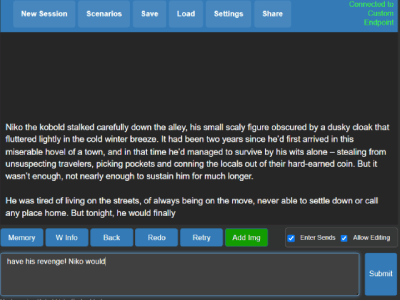
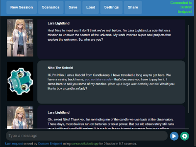
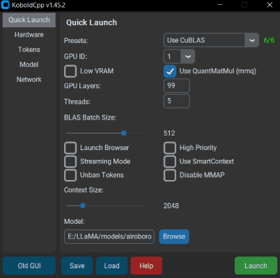

# koboldcpp

KoboldCpp is an easy-to-use AI text-generation software for GGML and GGUF models. It's a single self contained distributable from Concedo, that builds off llama.cpp, and adds a versatile Kobold API endpoint, additional format support, backward compatibility, as well as a fancy UI with persistent stories, editing tools, save formats, memory, world info, author's note, characters, scenarios and everything Kobold and Kobold Lite have to offer.






## Windows Usage
- **[Download the latest .exe release here](https://github.com/LostRuins/koboldcpp/releases/latest)** or clone the git repo.
- Windows binaries are provided in the form of **koboldcpp.exe**, which is a pyinstaller wrapper for a few **.dll** files and **koboldcpp.py**. You can also rebuild it yourself with the provided makefiles and scripts.
- Weights are not included, you can use the official llama.cpp `quantize.exe` to generate them from your official weight files (or download them from other places such as [TheBloke's Huggingface](https://huggingface.co/TheBloke).
- To run, execute **koboldcpp.exe** or drag and drop your quantized `ggml_model.bin` file onto the .exe, and then connect with Kobold or Kobold Lite. If you're not on windows, then run the script **KoboldCpp.py** after compiling the libraries.
- Launching with no command line arguments displays a GUI containing a subset of configurable settings. Generally you dont have to change much besides the `Presets` and `GPU Layers`. Read the `--help` for more info about each settings.
- By default, you can connect to http://localhost:5001
- You can also run it using the command line `koboldcpp.exe [ggml_model.bin] [port]`. For info, please check `koboldcpp.exe --help`

### Improving Performance
- **(Nivida Only) GPU Acceleration**: If you're on Windows with an Nvidia GPU you can get CUDA support out of the box using the `--usecublas` flag, make sure you select the correct .exe with CUDA support.
- **Any GPU Acceleration**: As a slightly slower alternative, try CLBlast with `--useclblast` flags for a slightly slower but more GPU compatible speedup.
- **GPU Layer Offloading**: Want even more speedup? Combine one of the above GPU flags with `--gpulayers` to offload entire layers to the GPU! **Much faster, but uses more VRAM**. Experiment to determine number of layers to offload, and reduce by a few if you run out of memory.
- **Increasing Context Size**: Try `--contextsize 4096` to 2x your context size! without much perplexity gain. Note that you'll have to increase the max context in the Kobold Lite UI as well (click and edit the number text field).
- **Reducing Prompt Processing**: Try the `--smartcontext` flag to reduce prompt processing frequency.
- If you are having crashes or issues, you can try turning off BLAS with the `--noblas` flag. You can also try running in a non-avx2 compatibility mode with `--noavx2`. Lastly, you can try turning off mmap with `--nommap`.

For more information, be sure to run the program with the `--help` flag, or [check the wiki](https://github.com/LostRuins/koboldcpp/wiki).

## Run on Colab
- KoboldCpp now has an **official Colab GPU Notebook**! This is an easy way to get started without installing anything in a minute or two. [Try it here!](https://colab.research.google.com/github/LostRuins/koboldcpp/blob/concedo/colab.ipynb).
- Note that KoboldCpp is not responsible for your usage of this Colab Notebook, you should ensure that your own usage complies with Google Colab's terms of use.

## OSX and Linux
- You will have to compile your binaries from source. A makefile is provided, simply run `make`.
- If you want you can also link your own install of OpenBLAS manually with `make LLAMA_OPENBLAS=1`
- Arch Linux users can install koboldcpp via the AUR package provided by @AlpinDale. Please see [below](#arch-linux) for more details.
- Alternatively, if you want you can also link your own install of CLBlast manually with `make LLAMA_CLBLAST=1`, for this you will need to obtain and link OpenCL and CLBlast libraries.
  - For Arch Linux: Install `cblas` `openblas` and `clblast`.
  - For Debian: Install `libclblast-dev` and `libopenblas-dev`.
- You can attempt a CuBLAS build with `LLAMA_CUBLAS=1`. You will need CUDA Toolkit installed. Some have also reported success with the CMake file, though that is more for windows.
- For a full featured build, do `make LLAMA_OPENBLAS=1 LLAMA_CLBLAST=1 LLAMA_CUBLAS=1`
- After all binaries are built, you can run the python script with the command `koboldcpp.py [ggml_model.bin] [port]`

- Note: Many OSX users have found that the using Accelerate is actually faster than OpenBLAS. To try, you may wish to run with `--noblas` and compare speeds.

### Arch Linux Packages
There are 4 AUR packages available: [CPU-only](https://aur.archlinux.org/packages/koboldcpp-cpu), [CLBlast](https://aur.archlinux.org/packages/koboldcpp-clblast), [CUBLAS](https://aur.archlinux.org/packages/koboldcpp-cuda), and [HIPBLAS](https://aur.archlinux.org/packages/koboldcpp-hipblas). They are, respectively, for users with no GPU, users with a GPU (vendor-agnostic), users with NVIDIA GPUs, and users with a supported AMD GPU.

The recommended installation method is through an AUR helper such as [paru](https://aur.archlinux.org/packages/paru) or [yay](https://aur.archlinux.org/packages/yay):

```sh
paru -S koboldcpp-cpu
```

Alternatively, you can manually install, though it's not recommended (since the build depends on [customtkinter](https://aur.archlinux.org/packages/customtkinter)):

```sh
git clone https://aur.archlinux.org/koboldcpp-cpu.git && cd koboldcpp-cpu

makepkg -si
```

You can then run koboldcpp anywhere from the terminal by running `koboldcpp` to spawn the GUI, or `koboldcpp --help` to view the list of commands for commandline execution (in case the GUI does not work).

## Compiling on Windows
- You're encouraged to use the .exe released, but if you want to compile your binaries from source at Windows, the easiest way is:
  - Use the latest release of w64devkit (https://github.com/skeeto/w64devkit). Be sure to use the "vanilla one", not i686 or other different stuff. If you try they will conflit with the precompiled libs!
  - Make sure you are using the w64devkit integrated terminal, then run 'make' at the KoboldCpp source folder. This will create the .dll files.
  - If you want to generate the .exe file, make sure you have the python module PyInstaller installed with pip ('pip install PyInstaller').
  - Run the script make_pyinstaller.bat at a regular terminal (or Windows Explorer).
  - The koboldcpp.exe file will be at your dist folder.
- If you wish to use your own version of the additional Windows libraries (OpenCL, CLBlast and OpenBLAS), you can do it with:
  - OpenCL - tested with https://github.com/KhronosGroup/OpenCL-SDK . If you wish to compile it, follow the repository instructions. You will need vcpkg.
  - CLBlast - tested with https://github.com/CNugteren/CLBlast . If you wish to compile it you will need to reference the OpenCL files. It will only generate the ".lib" file if you compile using MSVC.
  - OpenBLAS - tested with https://github.com/xianyi/OpenBLAS .
  - Move the respectives .lib files to the /lib folder of your project, overwriting the older files.
  - Also, replace the existing versions of the corresponding .dll files located in the project directory root (e.g. libopenblas.dll).
  - You can attempt a CuBLAS build with using the provided CMake file with visual studio. If you use the CMake file to build, copy the `koboldcpp_cublas.dll` generated into the same directory as the `koboldcpp.py` file. If you are bundling executables, you may need to include CUDA dynamic libraries (such as `cublasLt64_11.dll` and `cublas64_11.dll`) in order for the executable to work correctly on a different PC.
  - Make the KoboldCPP project using the instructions above.

## Android (Termux) Alternative method
- See https://github.com/ggerganov/llama.cpp/pull/1828/files

## AMD
- Please check out https://github.com/YellowRoseCx/koboldcpp-rocm

## Docker
- KoboldCpp has a few unofficial third-party community created docker images. Feel free to try them out, but do not expect up-to-date support:
  - https://github.com/korewaChino/koboldCppDocker
  - https://github.com/noneabove1182/koboldcpp-docker
- If you're building your own docker, remember to set CUDA_DOCKER_ARCH or enable LLAMA_PORTABLE

## Questions and Help
- **First, please check out [The KoboldCpp FAQ and Knowledgebase](https://github.com/LostRuins/koboldcpp/wiki) which may already have answers to your questions! Also please search through past issues and discussions.**
- If you cannot find an answer, open an issue on this github, or find us on the [KoboldAI Discord](https://koboldai.org/discord).

## Considerations
- For Windows: No installation, single file executable, (It Just Works)
- Since v1.0.6, requires libopenblas, the prebuilt windows binaries are included in this repo. If not found, it will fall back to a mode without BLAS.
- Since v1.15, requires CLBlast if enabled, the prebuilt windows binaries are included in this repo. If not found, it will fall back to a mode without CLBlast.
- Since v1.33, you can set the context size to be above what the model supports officially. It does increases perplexity but should still work well below 4096 even on untuned models. (For GPT-NeoX, GPT-J, and LLAMA models) Customize this with `--ropeconfig`.
- Since v1.42, supports GGUF models for LLAMA and Falcon
- **I plan to keep backwards compatibility with ALL past llama.cpp AND alpaca.cpp models**. But you are also encouraged to reconvert/update your models if possible for best results.

## License
- The original GGML library and llama.cpp by ggerganov are licensed under the MIT License
- However, Kobold Lite is licensed under the AGPL v3.0 License
- The other files are also under the AGPL v3.0 License unless otherwise stated

## Notes
- Generation delay scales linearly with original prompt length. If OpenBLAS is enabled then prompt ingestion becomes about 2-3x faster. This is automatic on windows, but will require linking on OSX and Linux. CLBlast speeds this up even further, and `--gpulayers` + `--useclblast` or `--usecublas` more so.
- I have heard of someone claiming a false AV positive report. The exe is a simple pyinstaller bundle that includes the necessary python scripts and dlls to run. If this still concerns you, you might wish to rebuild everything from source code using the makefile, and you can rebuild the exe yourself with pyinstaller by using `make_pyinstaller.bat`
- API documentation available at `/api` and https://lite.koboldai.net/koboldcpp_api
- Supported GGML models (Includes backward compatibility for older versions/legacy GGML models, though some newer features might be unavailable):
  - LLAMA and LLAMA2 (LLaMA / Alpaca / GPT4All / Vicuna / Koala / Pygmalion 7B / Metharme 7B / WizardLM and many more)
  - GPT-2 / Cerebras
  - GPT-J
  - RWKV
  - GPT-NeoX / Pythia / StableLM / Dolly / RedPajama
  - MPT models
  - Falcon (GGUF only)

