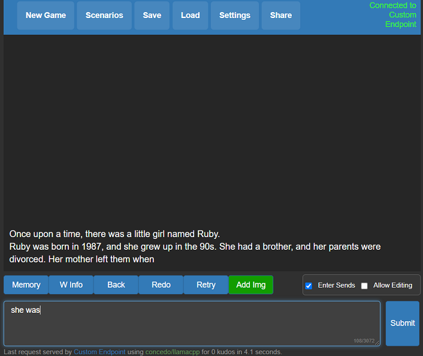

# llama-for-kobold

A self contained distributable from Concedo that exposes llama.cpp function bindings, allowing it to be used via a simulated Kobold API endpoint. 

What does it mean? You get llama.cpp with a fancy UI, persistent stories, editing tools, save formats, memory, world info, author's note, characters, scenarios and everything Kobold and Kobold Lite have to offer. In a tiny package under 1 MB in size, excluding model weights.

## Usage
- [Download the latest release here](https://github.com/LostRuins/llamacpp-for-kobold/releases/latest) or clone the repo.
- Windows binaries are provided in the form of **llamacpp-for-kobold.exe**, which is a pyinstaller wrapper for **llamacpp.dll** and **llama-for-kobold.py**. If you feel concerned, you may prefer to rebuild it yourself with the provided makefiles and scripts.
- Weights are not included, you can use the `quantize.exe` to generate them from your official weight files (or download them from other places).
- To run, execute **llamacpp-for-kobold.exe** or drag and drop your quantized ggml model.bin file onto the .exe, and then connect with Kobold or Kobold Lite. 
- By default, you can connect to http://localhost:5001 

## Considerations
- Don't want to use pybind11 due to dependencies on MSVCC
- ZERO or MINIMAL changes as possible to main.cpp - do not move their function declarations elsewhere!
- Leave main.cpp UNTOUCHED, We want to be able to update the repo and pull any changes automatically.
- No dynamic memory allocation! Setup structs with FIXED (known) shapes and sizes for ALL output fields. Python will ALWAYS provide the memory, we just write to it.
- No external libraries or dependencies. That means no Flask, Pybind and whatever. All You Need Is Python.

## License
- The original GGML library and llama.cpp by ggerganov are licensed under the MIT License
- However, Kobold Lite is licensed under the AGPL v3.0 License
- The provided python ctypes bindings in llamacpp.dll are also under the AGPL v3.0 License

## Notes
- There is a fundamental flaw with llama.cpp, which causes generation delay to scale linearly with original prompt length. If you care, **please contribute to [this discussion](https://github.com/ggerganov/llama.cpp/discussions/229)** which, if resolved, will actually make this viable.
