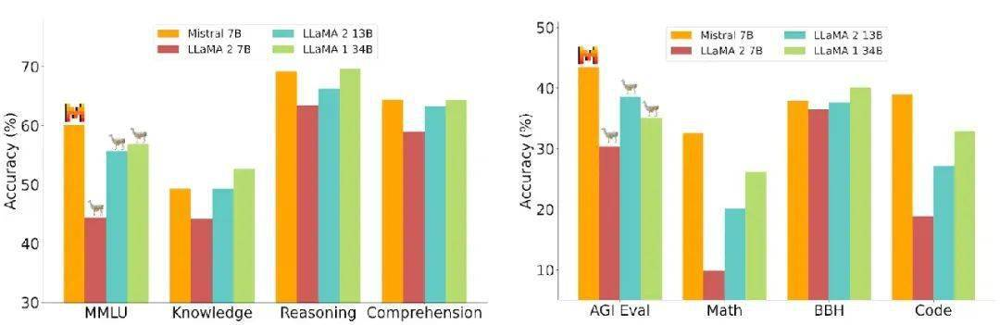
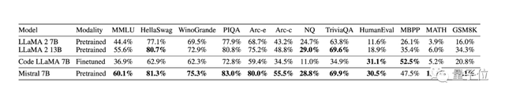
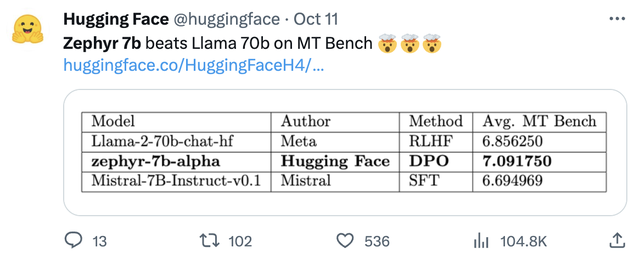
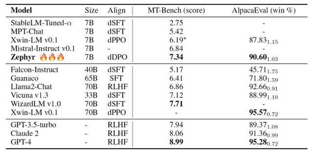

# llama.cpp

### 20231030

## VRAM

    1.在消费类硬件上运行 LLaMA 模型有多种不同的方法。 最常见的方法是使用单个 NVIDIA GeForce RTX 3090 GPU。 该 GPU 具有 24 GB 内存，足以运行 LLaMA 模型。 RTX 3090 可以运行 4 位量化的 LLaMA 30B 模型，每秒大约 4 到 10 个令牌。 24GB VRAM 似乎是在消费类台式电脑上使用单个 GPU 的最佳选择。
    2.但是，如果你想运行更大的模型，则必须使用双 GPU 设置。 这将允许你将模型权重放入 VRAM 中。 你还可以使用高级 GPU，例如 NVIDIA A100。 这个GPU非常昂贵，但有40GB内存，可以更好地运行模型。
    3.在 CPU 上运行 LLaMA 模型。 必须使用模型的 GGML 版本（LLaMA、Vicuna、Alpaca 和 GPT4All）以及名为 llama.cpp 的软件才能使用CPU。 
    4.训练或微调 LLaMA 模型需要比运行模型更多的 VRAM。 这是因为训练过程需要将模型以及训练数据存储在 VRAM 中。 训练所需的 VRAM 量取决于模型的大小和训练数据量。

## 投机采样 特别适用于代码生成 

  不量化，就用FP16精度也让34B的Code LLama跑在苹果电脑上，推理速度超过每秒20个token。草稿7b-q40,大模型32b
  ./speculative -m ggml-model-f16-32b.gguf   -md ggml-model-f16-7b-bc2-13b-chat-q2_k.gguf  -p "one day"  -e -ngl 1 -t 4 -n 512 -c 4096 -s 20 --top_k 1

### llama.cpp 的目标与初心

    llama.cpp 出现之后，在 GitHub 上狂砍 30k star，比 stable diffusion 还要夸张，堪称 star rocket。这背后是 llama.cpp 切中了 “AI at the edge” 这一方向。
    “AI at the edge“ 中的 edge 我理解为与 cloud 相对的概念。不管是个人的 laptop，gaming PC，手机，甚至树莓派，都可以称为 edge。

### 总结一下， llama.cpp 的初心是要把 LLaMA 模型在 MacBook 上跑起来。为此主要做 2 件事儿：

    quantization，目的是减少内存开销，而 llama.cpp 进一步让模型在精度损失与推理性能之间达到了一个微妙的平衡
    性能方向优化，包括语言的选择，采用向量化，GPU 加速等等手段
    对这两个方面的极致追求让 llama.cpp 收获了大批没有昂贵硬件，但却想尝试 LLM 的开发者的关注（包括我在内）。

### 相关结论：

    默认的量化方法为q4_0，虽然速度最快但损失也是最大的，其余方法各有利弊，按实际情况选择
    需要注意的是F16以及q8_0并不会因为增加线程数而提高太多速度
    线程数-t与物理核心数一致时速度最快，超过之后速度反而变慢（M1 Max上从8改到10之后耗时变为3倍）
    如果使用了Metal版本（即启用了苹果GPU解码），速度还会有进一步显著提升，表中标注为-ngl 1
    综合推荐（仅供参考）：7B推荐Q5_1或Q5_K_S，13B推荐Q5_0或Q5_K_S
    机器资源够用且对速度要求不是那么苛刻的情况下可以使用q8_0或Q6_K，接近F16模型的效果

## 云端环境准备：

    REPOSITORY        TAG                           IMAGE ID       CREATED         SIZE
    pytorch/pytorch   2.1.0-cuda12.1-cudnn8-devel   6f873147bf83   3 weeks ago     16.6GB

    docker run -e TZ="Asia/Shanghai" -it --name pytorch2 --gpus all -v /home/ubuntu:/root -v $PWD:/tmp -w /tmp pytorch/pytorch:2.1.0-cuda12.1-cudnn8-devel bash
    docker exec -it pytorch2 env LANG=C.UTF-8 TZ=Asia/Shanghai bash 

### 开发环境准备

    git clone https://github.com/ggerganov/llama.cpp
    make LLAMA_CLBLAST=1 LLAMA_NO_METAL=1

## macos: 边缘计算 端AI

### 准备开发环境
  
    xcode-select --install

### 克隆环境编译

  芯片组型号：	Intel HD Graphics 5000
  类型：	GPU
  总线：	内建
  VRAM（动态，最大值）：	1536 MB
  供应商：	Intel
  设备ID：	0x0a26
  修正版ID：	0x0009
  Metal 系列：	支持，Metal GPUFamily macOS 1

  LBlast是一个可用于生产环境，且高性能的OpenCL开源计算BLAS库，支持平台包括AMD、NVIDIA、Intel的CPU、GPU，也包括移动端领域如Adreno、Mali GPU。系统支持Windows、macOS以及Linux系统。
  CLBlast有下面几个优点：

      为调优（Tune）而生。
      可以为特定问题调优。
      支持FP16精度计算。
      支持批量操作（Batch），如BachedGEMM等。
      支持Cuda CLBlast更强调通用性，在率先支持AMD GPU后支持NVIDIA GPU的OpenCL计算，也支持将OpenCL 
      可集成到CUDA支持的项目中，将CUDA buffer直接作为输入；
      无OpenCL实现的NVIDIA硬件平台，如非X86的Jetson（ARM架构）和Driver PX系列以及IBM Power架构的超算平台等；
      性能与OpenCL版本的Kernel又有不同

      <!-- 安装clblast  -->
      brew update && brew install clblast
      <!-- 编译环境 -->
      MK_CPPFLAGS += -DGGML_USE_CLBLAST $(shell pkg-config --cflags-only-I clblast OpenCL)  -I/usr/local/include 
      MK_LDFLAGS += -lclblast -framework OpenCL   -L/usr/local/lib
      <!-- 编译 -->
      make clean
      make LLAMA_CLBLAST=1 LLAMA_NO_METAL=1
      <!-- VRAM（动态，最大值）：	1536 MB Intel GMA HD 5000为1.5GB（最大共享系统内存）-->
      ./main  --ignore-eos -c 64 -n 128 -t 3 -ngl 10

### 模型格式转换

    python convert-baichuan-hf-to-gguf.py  ../models/baichuan-inc/Baichuan2-7B-Chat/
    python convert-baichuan-hf-to-gguf.py  ../models/baichuan-inc/Baichuan2-13B-Chat/

### 模型量化q4_k

    ./quantize ../models/baichuan-inc/Baichuan2-7B-Chat/ggml-model-f16.gguf ../models/ggml-model-f16-bc2-7b-chat-q4_k.gguf q4_k
    ./quantize ../models/baichuan-inc/Baichuan2-7B-Chat/ggml-model-f16.gguf ../models/ggml-model-f16-bc2-7b-chat-q2_k.gguf q2_k
    ./quantize ../models/baichuan-inc/Baichuan2-13B-Chat/ggml-model-f16.gguf ../models/ggml-model-f16-bc2-13b-chat-q8_0.gguf q8_0
    ./quantize ../models/baichuan-inc/Baichuan2-13B-Chat/ggml-model-f16.gguf ../models/ggml-model-f16-bc2-13b-chat-q2_k.gguf q2_k

### 推理，显卡clblast -ngl 10  

        比较重要的参数：

        -ins 启动类ChatGPT的对话交流模式
        -f 指定prompt模板，alpaca模型请加载prompts/alpaca.txt 指令模板
        -c 控制上下文的长度，值越大越能参考更长的对话历史（默认：512）
        -n 控制回复生成的最大长度（默认：128）
        --repeat_penalty 控制生成回复中对重复文本的惩罚力度
        --temp 温度系数，值越低回复的随机性越小，反之越大
        --top_p, top_k 控制解码采样的相关参数
        -b 控制batch size（默认：512）

      <!-- 3G -->
    ./main -m ../models/ggml-model-f16-bc2-7b-chat-q4_k.gguf  -t 2 -ngl 8 -n 128 -p '写一首藏头诗五言绝句，每句诗的开头字母分别是"莫""勇"二字：'
    <!-- 6.5G 勉强能跑-->
    ./main -m ../models/ggml-model-f16-bc2-13b-chat-q2_k.gguf -t 2 -ngl 6 -n 128 -p '写一首藏头诗五言绝句，每句诗的开头字母分别是"莫""勇"二字：'
    写一首藏头诗五言绝句，每句诗的开头字母分别是"莫""勇"二字：
    莫 问前程几许远，
    勇 攀高峰笑傲天。
    志 在四方谁敢挡，
    怀 抱梦想永向前。 [end of text]
    <!-- 12G -->
    ./main -m ../models/ggml-model-f16-bc2-13b-chat-q8_0.gguf -t 2 -ngl 5 -n 128 -p '写一首藏头诗五言绝句，每句诗的开头字母分别是"莫""勇"二字：'

### 对话模式

    ./main -m ../models/ggml-model-f16-bc2-13b-chat-q8_0.gguf  -ngl 10  -n 256 --repeat_penalty 1.0 --color -i -r "User:" -f prompts/chat-with-baichuan.txt

### 投机采样推理 q4_k 草稿；fp16原始模型 TODO 内存不够

    ./speculative -m ../models/ggml-model-f16-bc2-13b-chat-q8_0.gguf  -md ../models/ggml-model-f16-bc2-7b-chat-q4_k.gguf   -p '写一首五言绝句'  -e -t 4 -n 512 -c 4096 -s 20 --top_k 1  -ngl 1

### 评估命令

    ./perplexity -m ../models/ggml-model-f16-bc2-7b-chat-q4_k.gguf -f prompts/chat-with-baichuan.txt -c 4096 -t 2 -ngl 6

### 垂直领域小模型边缘计算

    shaowenchen/chinese-llama-2-13b-16k-gguf/chinese-llama-2-13b-16k.Q3_K_S.gguf

### 目前最强

    zephyr-7b-beta

### 模型对比

    Mistral7B可能是其中最强的：
    1. 小型如何非要划一个界限 <= 7B
    2. 参数量小，不等于训练数据量小
    3. 小型 LLM 在特定任务上微调，堪比大模型，甚至超过
    小型模型有其天然的属性，可能更快的落地，在一些边缘端会发挥更大的作用。

    Mistral 7B是由Mistral AI发布的一个拥有70亿参数的语言模型。是一个精心设计的语言模型，旨在提供高效和高性能，以实现真实世界的应用。由于其效率的提升，该模型适用于需要快速响应的实时应用。在发布时，Mistral 7B在所有评估基准中都超过了最佳的开源13B模型（Llama 2）。

    该模型使用了如下的注意力机制：
    - grouped-query attention (GQA)，目的是为了更快的推理和减少解码过程中的内存需求。
    - sliding window attention (SWA)，目的是用较低的推理成本处理任意长度的序列。

    Mistral 7B在各种基准测试中展现出卓越的性能，甚至超过了参数更多的模型。它在数学、代码生成和推理等领域表现出色。以下是在数学推理、世界知识和常识推理等多个任务上的结果：

        
        
        
        
        

    MT-Bench是评估模型处理多轮对话能力的基准测试，问题集涵盖写作、角色扮演、提取等8个类别。

    Mistral-7B-Instruct
    Mistral 7B旨在轻松调整以适应各种任务。Mistral 7B Instruct模型是一个快速演示，基础模型可以轻松进行微调以实现引人注目的性能。该版本的模型经过微调，适用于对话和问题回答。

### mistral7b 微调

    扩充tokener
    合并checkpoint
