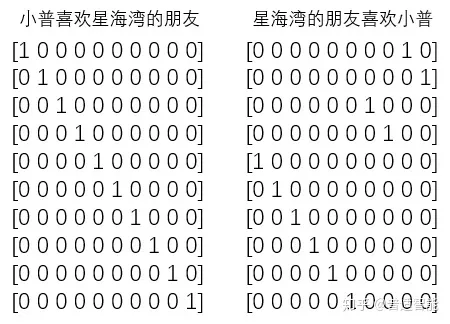
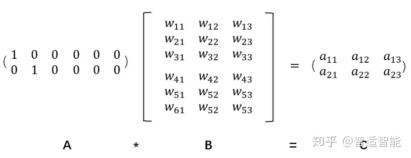
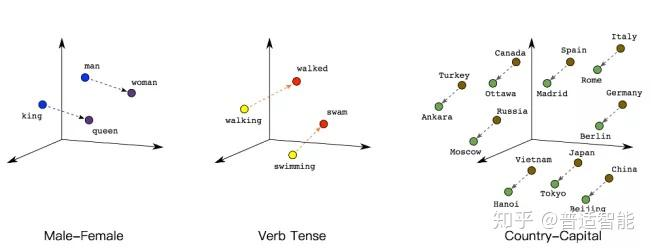

# llama.cpp/example/embedding

        Embedding层(嵌入层)的一个作用——降维，降维的原理就是矩阵乘法。
        
        one-hot这是它最明显的缺点：过于稀疏时，过度占用资源。
        
        把一个A中的12个元素的矩阵变成C中6个元素的矩阵，直观上，大小是不是缩小了一半？

        Embedding的又一个作用对低维的数据进行升维，把一些其他特征给放大，或者把笼统的特征给分开了。
        由此可见，距离的远近会影响我们的观察效果。
        同理也是一样的，低维的数据可能包含的特征是非常笼统的，我们需要不停地拉近拉远来改变我们的感受，让我们对这幅图有不同的观察点，找出我们要的"茬"。

        语义理解中Embedding意义
        通过将两个无法比较的文字映射成向量，接下来就能实现对他们的计算。
        
        queen（皇后）= king（国王）- man（男人）+ woman（女人）
        这样计算机能明白，“皇后啊，就是女性的国王呗！”
        walked（过去式）= walking（进行时）- swimming（进行时）+ swam（过去式）
        同理计算机也能明白，“walked，就是walking的过去式啦！”另外，向量间的距离也可能会建立联系，比方说“北京”是“中国”的首都，“巴黎”是“法国”的首都，那么向量：|中国|-|北京|=|法国|-|巴黎|


This example demonstrates generate high-dimensional embedding vector of a given text with llama.cpp.
此示例演示如何使用 llama.cpp 生成给定文本的高维嵌入向量。

## Quick Start

To get started right away, run the following command, making sure to use the correct path for the model you have:
若要立即开始，请运行以下命令，确保对已有的模型使用正确的路径：

### Unix-based systems (Linux, macOS, etc.):

```bash
./embedding -m ./path/to/model --log-disable -p "Hello World!" 2>/dev/null
./embedding -m ../models/ggmls/openbuddy-mistral-7b-v13.1-q4_0.gguf --log-disable -p "Hello World!" 2>/dev/null
./embedding -m ../models/ggmls/openbuddy-mistral-7b-v13.1-q4_0.gguf --log-disable -p "清晨早雨浥轻尘" 2>/dev/null
```

### Windows:

```powershell
embedding.exe -m ./path/to/model --log-disable -p "Hello World!" 2>$null
```

The above command will output space-separated float values.
