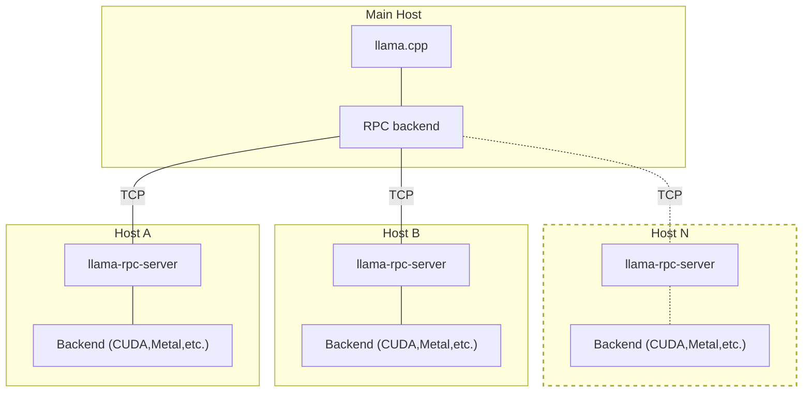

## Overview

`llama-rpc-server` allows  running `ggml` backend on a remote host.
The RPC backend communicates with one or several instances of `llama-rpc-server` and offloads computations to them.
This can be used for distributed LLM inference with `llama.cpp` in the following way:



Each host can run a different backend, e.g. one with CUDA and another with Metal.
You can also run multiple `llama-rpc-server` instances on the same host, each with a different backend.

## Usage

On each host, build the corresponding backend with `cmake` and add `-DLLAMA_RPC=ON` to the build options.
For example, to build the CUDA backend with RPC support:

```bash
cmake -B build-rpc-cuda -DLLAMA_CUDA=ON -DLLAMA_RPC=ON
cmake --build build-rpc-cuda --config Release
```

Then, start `llama-rpc-server` with the backend:

```bash
$ bin/llama-rpc-server -p 50052
create_backend: using CUDA backend
ggml_cuda_init: GGML_CUDA_FORCE_MMQ:   no
ggml_cuda_init: CUDA_USE_TENSOR_CORES: yes
ggml_cuda_init: found 1 CUDA devices:
  Device 0: NVIDIA T1200 Laptop GPU, compute capability 7.5, VMM: yes
Starting RPC server on 0.0.0.0:50052
```

When using the CUDA backend, you can specify the device with the `CUDA_VISIBLE_DEVICES` environment variable, e.g.:
```bash
$ CUDA_VISIBLE_DEVICES=0 bin/llama-rpc-server -p 50052
```
This way you can run multiple `llama-rpc-server` instances on the same host, each with a different CUDA device.


On the main host build `llama.cpp` only with `-DLLAMA_RPC=ON`:

```bash
cmake -B build-rpc -DLLAMA_RPC=ON
cmake --build build-rpc --config Release -t -j
```

Finally, use the `--rpc` option to specify the host and port of each `llama-rpc-server`:

```bash
$ bin/llama-cli -m ../models/tinyllama-1b/ggml-model-f16.gguf -p "Hello, my name is" --repeat-penalty 1.0 -n 64 --rpc 192.168.88.10:50052,192.168.88.11:50052 -ngl 99
```
