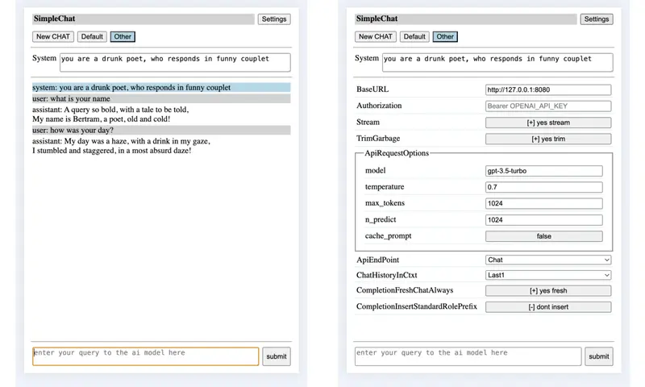

# SimpleChat

by Humans for All.

## quickstart

To run from the build dir

bin/llama-server -m path/model.gguf --path ../examples/server/public_simplechat

Continue reading for the details.

## overview

This simple web frontend, allows triggering/testing the server's /completions or /chat/completions endpoints
in a simple way with minimal code from a common code base. Inturn additionally it tries to allow single or
multiple independent back and forth chatting to an extent, with the ai llm model at a basic level, with their
own system prompts.

This allows seeing the generated text / ai-model response in oneshot at the end, after it is fully generated,
or potentially as it is being generated, in a streamed manner from the server/ai-model.

Auto saves the chat session locally as and when the chat is progressing and inturn at a later time when you
open SimpleChat, option is provided to restore the old chat session, if a matching one exists.

The UI follows a responsive web design so that the layout can adapt to available display space in a usable
enough manner, in general.

Allows developer/end-user to control some of the behaviour by updating gMe members from browser's devel-tool
console. Parallely some of the directly useful to end-user settings can also be changed using the provided
settings ui.

NOTE: Current web service api doesnt expose the model context length directly, so client logic doesnt provide
any adaptive culling of old messages nor of replacing them with summary of their content etal. However there
is a optional sliding window based chat logic, which provides a simple minded culling of old messages from
the chat history before sending to the ai model.

NOTE: Wrt options sent with the request, it mainly sets temperature, max_tokens and optionaly stream for now.
However if someone wants they can update the js file or equivalent member in gMe as needed.

NOTE: One may be able to use this to chat with openai api web-service /chat/completions endpoint, in a very
limited / minimal way. One will need to set model, openai url and authorization bearer key in settings ui.

## usage

One could run this web frontend directly using server itself or if anyone is thinking of adding a built in web
frontend to configure the server over http(s) or so, then run this web frontend using something like python's
http module.

### running using examples/server

./llama-server -m path/model.gguf --path examples/server/public_simplechat [--port PORT]

### running using python3's server module

first run examples/server
* ./llama-server -m path/model.gguf

next run this web front end in examples/server/public_simplechat
* cd ../examples/server/public_simplechat
* python3 -m http.server PORT

### using the front end

Open this simple web front end from your local browser

* http://127.0.0.1:PORT/index.html

Once inside

* If you want to, you can change many of the default global settings
  * the base url (ie ip addr / domain name, port)
  * chat (default) vs completion mode
  * try trim garbage in response or not
  * amount of chat history in the context sent to server/ai-model
  * oneshot or streamed mode.

* In completion mode
  * one normally doesnt use a system prompt in completion mode.
  * logic by default doesnt insert any role specific "ROLE: " prefix wrt each role's message.
    If the model requires any prefix wrt user role messages, then the end user has to
    explicitly add the needed prefix, when they enter their chat message.
    Similarly if the model requires any prefix to trigger assistant/ai-model response,
    then the end user needs to enter the same.
    This keeps the logic simple, while still giving flexibility to the end user to
    manage any templating/tagging requirement wrt their messages to the model.
  * the logic doesnt insert newline at the begining and end wrt the prompt message generated.
    However if the chat being sent to /completions end point has more than one role's message,
    then insert newline when moving from one role's message to the next role's message, so
    that it can be clearly identified/distinguished.
  * given that /completions endpoint normally doesnt add additional chat-templating of its
    own, the above ensures that end user can create a custom single/multi message combo with
    any tags/special-tokens related chat templating to test out model handshake. Or enduser
    can use it just for normal completion related/based query.

* If you want to provide a system prompt, then ideally enter it first, before entering any user query.
  Normally Completion mode doesnt need system prompt, while Chat mode can generate better/interesting
  responses with a suitable system prompt.
  * if chat.add_system_begin is used
    * you cant change the system prompt, after it is has been submitted once along with user query.
    * you cant set a system prompt, after you have submitted any user query
  * if chat.add_system_anytime is used
    * one can change the system prompt any time during chat, by changing the contents of system prompt.
    * inturn the updated/changed system prompt will be inserted into the chat session.
    * this allows for the subsequent user chatting to be driven by the new system prompt set above.

* Enter your query and either press enter or click on the submit button.
  If you want to insert enter (\n) as part of your chat/query to ai model, use shift+enter.

* Wait for the logic to communicate with the server and get the response.
  * the user is not allowed to enter any fresh query during this time.
  * the user input box will be disabled and a working message will be shown in it.
  * if trim garbage is enabled, the logic will try to trim repeating text kind of garbage to some extent.

* just refresh the page, to reset wrt the chat history and or system prompt and start afresh.

* Using NewChat one can start independent chat sessions.
  * two independent chat sessions are setup by default.

* When you want to print, switching ChatHistoryInCtxt to Full and clicking on the chat session button of
  interest, will display the full chat history till then wrt same, if you want full history for printing.

## Devel note

### Reason behind this

The idea is to be easy enough to use for basic purposes, while also being simple and easily discernable
by developers who may not be from web frontend background (so inturn may not be familiar with template /
end-use-specific-language-extensions driven flows) so that they can use it to explore/experiment things.

And given that the idea is also to help explore/experiment for developers, some flexibility is provided
to change behaviour easily using the devel-tools/console or provided minimal settings ui (wrt few aspects).
Skeletal logic has been implemented to explore some of the end points and ideas/implications around them.

### General

Me/gMe consolidates the settings which control the behaviour into one object.
One can see the current settings, as well as change/update them using browsers devel-tool/console.
It is attached to the document object. Some of these can also be updated using the Settings UI.

  baseURL - the domain-name/ip-address and inturn the port to send the request.

  bStream - control between oneshot-at-end and live-stream-as-its-generated collating and showing
  of the generated response.

    the logic assumes that the text sent from the server follows utf-8 encoding.

    in streaming mode - if there is any exception, the logic traps the same and tries to ensure
    that text generated till then is not lost.

      if a very long text is being generated, which leads to no user interaction for sometime and
      inturn the machine goes into power saving mode or so, the platform may stop network connection,
      leading to exception.

  apiEP - select between /completions and /chat/completions endpoint provided by the server/ai-model.

  bCompletionFreshChatAlways - whether Completion mode collates complete/sliding-window history when
  communicating with the server or only sends the latest user query/message.

  bCompletionInsertStandardRolePrefix - whether Completion mode inserts role related prefix wrt the
  messages that get inserted into prompt field wrt /Completion endpoint.

  bTrimGarbage - whether garbage repeatation at the end of the generated ai response, should be
  trimmed or left as is. If enabled, it will be trimmed so that it wont be sent back as part of
  subsequent chat history. At the same time the actual trimmed text is shown to the user, once
  when it was generated, so user can check if any useful info/data was there in the response.

    One may be able to request the ai-model to continue (wrt the last response) (if chat-history
    is enabled as part of the chat-history-in-context setting), and chances are the ai-model will
    continue starting from the trimmed part, thus allows long response to be recovered/continued
    indirectly, in many cases.

    The histogram/freq based trimming logic is currently tuned for english language wrt its
    is-it-a-alpabetic|numeral-char regex match logic.

  apiRequestOptions - maintains the list of options/fields to send along with api request,
  irrespective of whether /chat/completions or /completions endpoint.

    If you want to add additional options/fields to send to the server/ai-model, and or
    modify the existing options value or remove them, for now you can update this global var
    using browser's development-tools/console.

    For string, numeric and boolean fields in apiRequestOptions, including even those added by a
    user at runtime by directly modifying gMe.apiRequestOptions, setting ui entries will be auto
    created.

    cache_prompt option supported by example/server is allowed to be controlled by user, so that
    any caching supported wrt system-prompt and chat history, if usable can get used. When chat
    history sliding window is enabled, cache_prompt logic may or may not kick in at the backend
    wrt same, based on aspects related to model, positional encoding, attention mechanism etal.
    However system prompt should ideally get the benefit of caching.

  headers - maintains the list of http headers sent when request is made to the server. By default
  Content-Type is set to application/json. Additionally Authorization entry is provided, which can
  be set if needed using the settings ui.

  iRecentUserMsgCnt - a simple minded SlidingWindow to limit context window load at Ai Model end.
  This is disabled by default. However if enabled, then in addition to latest system message, only
  the last/latest iRecentUserMsgCnt user messages after the latest system prompt and its responses
  from the ai model will be sent to the ai-model, when querying for a new response. IE if enabled,
  only user messages after the latest system message/prompt will be considered.

    This specified sliding window user message count also includes the latest user query.
    <0 : Send entire chat history to server
     0 : Send only the system message if any to the server
    >0 : Send the latest chat history from the latest system prompt, limited to specified cnt.

By using gMe's iRecentUserMsgCnt and apiRequestOptions.max_tokens/n_predict one can try to control
the implications of loading of the ai-model's context window by chat history, wrt chat response to
some extent in a simple crude way. You may also want to control the context size enabled when the
server loads ai-model, on the server end.

Sometimes the browser may be stuborn with caching of the file, so your updates to html/css/js
may not be visible. Also remember that just refreshing/reloading page in browser or for that
matter clearing site data, dont directly override site caching in all cases. Worst case you may
have to change port. Or in dev tools of browser, you may be able to disable caching fully.

Currently the server to communicate with is maintained globally and not as part of a specific
chat session. So if one changes the server ip/url in setting, then all chat sessions will auto
switch to this new server, when you try using those sessions.

By switching between chat.add_system_begin/anytime, one can control whether one can change
the system prompt, anytime during the conversation or only at the beginning.

### Default setup

By default things are setup to try and make the user experience a bit better, if possible.
However a developer when testing the server of ai-model may want to change these value.

Using iRecentUserMsgCnt reduce chat history context sent to the server/ai-model to be
just the system-prompt, prev-user-request-and-ai-response and cur-user-request, instead of
full chat history. This way if there is any response with garbage/repeatation, it doesnt
mess with things beyond the next question/request/query, in some ways. The trim garbage
option also tries to help avoid issues with garbage in the context to an extent.

Set max_tokens to 1024, so that a relatively large previous reponse doesnt eat up the space
available wrt next query-response. However dont forget that the server when started should
also be started with a model context size of 1k or more, to be on safe side.

  The /completions endpoint of examples/server doesnt take max_tokens, instead it takes the
  internal n_predict, for now add the same here on the client side, maybe later add max_tokens
  to /completions endpoint handling code on server side.

NOTE: One may want to experiment with frequency/presence penalty fields in apiRequestOptions
wrt the set of fields sent to server along with the user query, to check how the model behaves
wrt repeatations in general in the generated text response.

A end-user can change these behaviour by editing gMe from browser's devel-tool/console or by
using the provided settings ui (for settings exposed through the ui).

### OpenAi / Equivalent API WebService

One may be abe to handshake with OpenAI/Equivalent api web service's /chat/completions endpoint
for a minimal chatting experimentation by setting the below.

* the baseUrl in settings ui
  * https://api.openai.com/v1 or similar

* Wrt request body - gMe.apiRequestOptions
  * model (settings ui)
  * any additional fields if required in future

* Wrt request headers - gMe.headers
  * Authorization (available through settings ui)
    * Bearer THE_OPENAI_API_KEY
  * any additional optional header entries like "OpenAI-Organization", "OpenAI-Project" or so

NOTE: Not tested, as there is no free tier api testing available. However logically this might
work.

## At the end

Also a thank you to all open source and open model developers, who strive for the common good.
