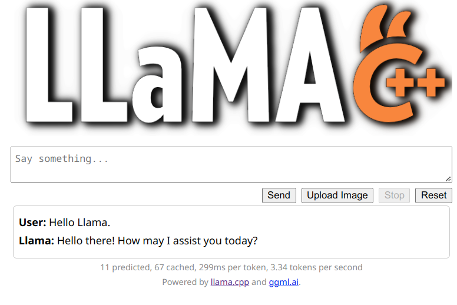

# LLaMA.cpp Server Buttons Top Theme

Simple tweaks to the UI. Chat buttons at the top of the page instead of bottom so you can hit Stop instead of chasing it down the page.

To use simply run server with `--path=themes/buttons_top`

