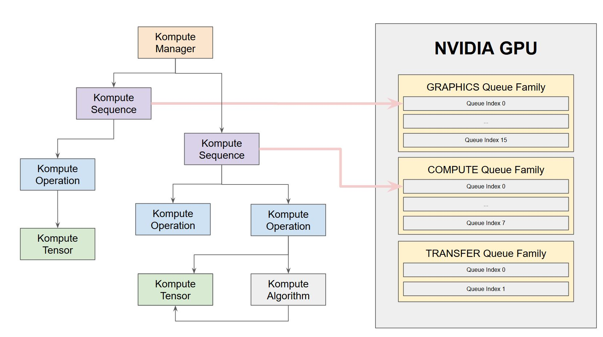

Asynchronous and Parallel Operations
=============

In GPU computing it is possible to have multiple levels of asynchronous and parallel processing of GPU tasks.

It is important to understand the conceptual distinctions of the diffent terminology when using each of these components.

In this section we will cover the following points:

* Asynchronous operation submission
* Parallel processing of operations

You can also find the published `blog post on the topic using Kompute <https://towardsdatascience.com/parallelizing-heavy-gpu-workloads-via-multi-queue-operations-50a38b15a1dc>`_, which covers the points discussed in this section further.

Below is the architecture we'll be covering further in the parallel operations section through command submission across multiple family queues.

Asynchronous operation submission
---------------------------------

As the name implies, this refers to the asynchronous submission of operations. This means that operations can be submitted to the GPU, and the C++ / host CPU can continue performing tasks, until when the user desires to run `await` to wait until the operation finishes.

This basically provides further granularity on vk::Fences, which is its means to enable the CPU host to know when GPU commands have finished executing. 

It is important that submitting tasks asynchronously, does not mean that these will be executed in parallel. Parallel execution of operations will be covered in the following section.

Asynchronous operation submission can be achieved through the :class:`kp::Manager`, or directly through the :class:`kp::Sequence`. Below is an example using the Kompute manager.

Conceptual Overview
^^^^^^^^^^^^^^^^^^^^^

Asynchronous job submission is done using `evalOpAsync` and `evalOpAwait` functions.

For simplicity the `evalOpAsyncDefault` and `evalOpAwaitDefault` functions are provided, which can be used similar to the synchronous counterparts (which basically use the default named sequence).

One important thing to bare in mind when using asynchronous submissions, is that you should make sure that any overlapping asynchronous functions are run in separate sequences.

The reason why this is important is that the Await function not only waits for the fence, but also runs the `postEval` functions across all operations, which is required for several operations.

Async and Parallel Examples
^^^^^^^^^^^^^^^^^^^^^^^^^^^^^^

We have added a set of examples for asynchronous and parallel processing examples in the `Advanced Examples documentation page <advanced-examples.rst>`_

