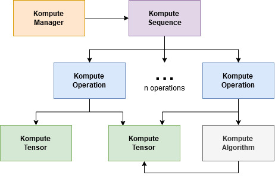

Python Package Overview
========

This section provides an overview of the Python Package from a functionality perspective. If you wish to see examples check the `Python Simple & Advanced Examples section <python-examples.html>`_ all the classes and their respective functions you can find that in the `Python Class Reference Section <python-reference.html>`_.

Below is a diagram that provides insights on the relationship between Kompute objects and Vulkan SDK resources, which primarily encompass ownership of either CPU and/or GPU memory.



Package Installation 
^^^^^^^^^

Make sure you have the following dependencies installed:

* CMAKE v3.41+ (install in `Windows <https://tulip.labri.fr/TulipDrupal/?q=node/1081>`_, `Linux (Ubuntu) <https://vitux.com/how-to-install-cmake-on-ubuntu-18-04/>`_, `Mac <https://medium.com/r?url=https%3A%2F%2Fstackoverflow.com%2Fa%2F59825656%2F1889253>`_)
* Vulkan SDK installed via `official website <https://vulkan.lunarg.com/sdk/home>`_
* C++ compiler (eg. gcc for linux / mac, MSVC for Windows)

Once you set up the package dependencies, you can install Kompute from ```Pypi``` using ```pip``` by running:

.. code-block:: bash

    pip install kp

You can also install from master branch using:

.. code-block:: python

    pip install git+git://github.com/KomputeProject/kompute.git@master


Core Python Components
^^^^^^^^

The Python package exposes three main classes:

* :class:`kp.Manager` - Manages all high level GPU and Kompute resources created
* :class:`kp.Sequence` - Contains a set of recorded operations that can be reused
* :class:`kp.Tensor` - Core data component to manage GPU and host data used in operations

One thing that you will notice is that the class :class:`kp::OpBase` and all its relevant operator subclasses are not exposed in Python.

This is primarily because the way to interact with the operations are through the respective :class:`kp.Manager` and :class:`kp.Sequence` functions.

More specifically, it can be through the following functions:

* mgr.eval_<opname> - Runs operation under an existing named sequence
* mgr.eval_<opname>_def - Runs operation under a new anonymous sequence
* mgr.eval_async_<opname> - Runs operation asynchronously under an existing named sequence
* mgr.eval_async_<opname>_def - Runs operation asynchronously under a new anonymous sequence
* seq.record_<opname> - Records operation in sequence (requires sequence to be in recording mode)

Tensor Component
------------------

The `kp.Tensor` component provides utilities to load and manage data into GPU memory.

The primary interface to the GPU image leverage `np.array` containers which wrap the GPU memory.

One of the key things to take into consideration is the GPU memory and resource management that is provided by Kompute - namely the `kp.Tensor` allows for the memory to be managed until the python object refcount goes down to zero or is explicitly destroyed with the `destroy()` function.

Another thing to bare in mind is that when the `.data()` function is called, the numpy array would add an extra refcount, and the underlying resources won't be destroyed until that object is destroyed. This is shown more intuitively in the example below:

.. code-block:: python
   :linenos:

    m = kp.Manager()

    t = m.tensor([1,2,3])

    td = t.data()

    del t

    td
    # this is OK

    assert td.base.is_init() == True # OK

    m.destroy() # Frees all memory inside tensors

    assert td.base.is_init() == False # Consistent to expected setup

    del td # Now this calls tensor destructor as refcount reaches 0


Log Level Configuration
^^^^^^

Logging inside the C++ uses the PyBind logging, which allows for all the std::cout to be passed to a python logger.

All python output is logged to the logger with the name `kp`. You can interact with the logger similar to any python logging as per the example below:


.. code-block:: python
   :linenos:

    >>> import kp
    >>> import logging
    >>>
    >>> kp_logger = logging.getLogger("kp")
    >>> kp_logger.setLevel(logging.INFO)
    >>>
    >>> kp.Manager()
    INFO:kp:Using physical device index {} found {}
    <kp.Manager object at 0x7f2ac075ca30>

    >>> kp_logger.setLevel(logging.DEBUG)
    >>>
    >>> kp.Manager()
    DEBUG:kp:Kompute Manager creating instance
    DEBUG:kp:Kompute Manager Instance Created
    DEBUG:kp:Kompute Manager creating Device
    INFO:kp:Using physical device index {} found {}
    DEBUG:kp:Kompute Manager device created
    DEBUG:kp:Kompute Manager compute queue obtained
    DEBUG:kp:Kompute Manager Destructor started
    INFO:kp:Destroying device
    DEBUG:kp:Kompute Manager Destroyed Device
    DEBUG:kp:Kompute Manager Destroyed Instance
    <kp.Manager object at 0x7f2af6109e30>

