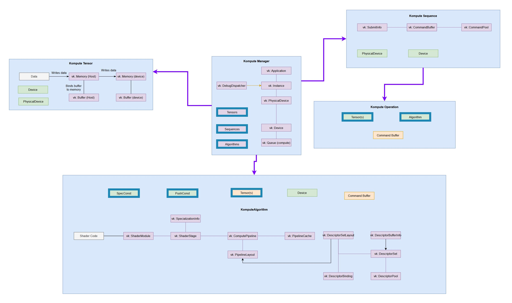
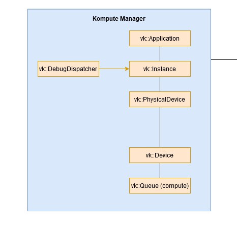
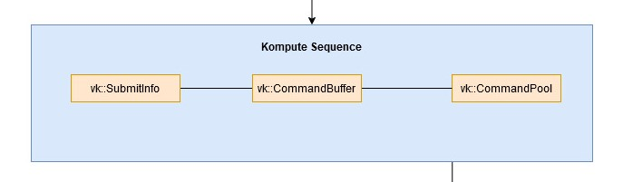
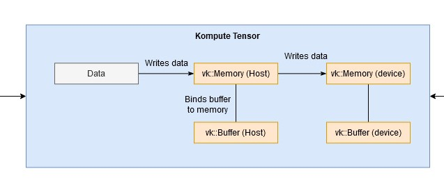
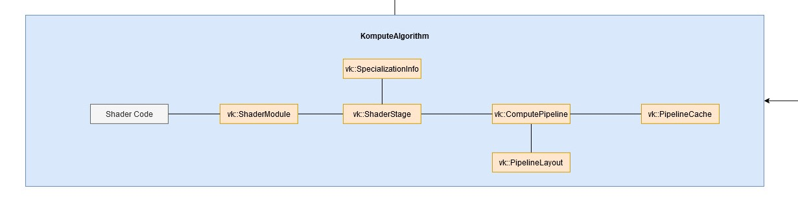
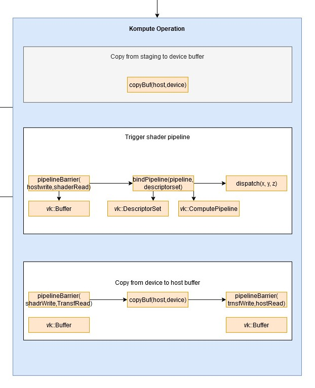

Class Documentation and C++ Reference
========

This section provides a breakdown of the cpp classes and what each of their functions provide. It is partially generated and augomented from the Doxygen autodoc content. You can also go directly to the `raw doxygen docs <../doxygen/annotated.html>`_.

Below is a diagram that provides insights on the relationship between Kompute objects and Vulkan SDK resources, which primarily encompass ownership of either CPU and/or GPU memory.

Manager
-------

The Kompute Manager provides a high level interface to simplify interaction with underlying :class:`kp::Sequences` of :class:`kp::Operations`.

.. doxygenclass:: kp::Manager
   :members:

Sequence
-------

The Kompute Sequence consists of batches of :class:`kp::Operations`, which are executed on a respective GPU queue. The execution of sequences can be synchronous or asynchronous, and it can be coordinated through its respective vk::Fence.

.. doxygenclass:: kp::Sequence
   :members:

Tensor
-------

The :class:`kp::Tensor` is the atomic unit in Kompute, and it is used primarily for handling Host and GPU Device data.

.. doxygenclass:: kp::Tensor
   :members:

Algorithm
-------

The :class:`kp::Algorithm` consists primarily of the components required for shader code execution, including the relevant vk::DescriptorSet relatedresources as well as vk::Pipeline and all the relevant Vulkan SDK resources as outlined in the architectural diagram.

.. doxygenclass:: kp::Algorithm
   :members:

OpBase
-------

The :class:`kp::OpBase` provides a top level class for an operation in Kompute, which is the step that is executed on a GPU submission. The Kompute operations can consist of one or more :class:`kp::Tensor`.

.. doxygenclass:: kp::OpBase
   :members:

OpAlgoDispatch
-------

The `vk::OpAlgoDispatch` extends the `vk::OpBase` class, and provides the base for shader-based operations. Besides of consisting of one or more `vk::Tensor` as per the `vk::OpBase`, it also contains a unique `vk::Algorithm`.

.. image:: ../images/kompute-vulkan-architecture-opmult.jpg
   :width: 100%

.. doxygenclass:: kp::OpAlgoDispatch
   :members:

OpMult
-------

The :class:`kp::OpMult` operation is a sample implementation of the :class:`kp::OpAlgoBase` class. This class shows how it is possible to create a custom vk::OpAlgoBase that can compile as part of the binary. The :class:`kp::OpMult` operation uses the shader-to-cpp-header-file script to convert the script into cpp header files.

.. image:: ../images/kompute-vulkan-architecture-opmult.jpg
   :width: 100%

.. doxygenclass:: kp::OpMult
   :members:

OpTensorCopy
-------

The :class:`kp::OpTensorCopy` is a tensor only operation that copies the GPU memory buffer data from one :class:`kp::Tensor` to one or more subsequent tensors.

.. doxygenclass:: kp::OpTensorCopy
   :members:

OpTensorSyncLocal
-------

The :class:`kp::OpTensorSyncLocal` is a tensor only operation that maps the data from the GPU device memory into the local host vector.

.. doxygenclass:: kp::OpTensorSyncLocal
   :members:

OpTensorSyncDevice
-------

The :class:`kp::OpTensorSyncDevice` is a tensor only operation that maps the data from the local host vector into the GPU device memory.

.. doxygenclass:: kp::OpTensorSyncDevice
   :members:

OpMemoryBarrier
-------

The :class:`kp::OpMemoryBarrier` is a tensor only operation which adds memory barriers to the tensors provided with the access and stage masks provided.

.. doxygenclass:: kp::OpTensorSyncDevice
   :members:

